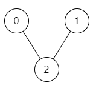
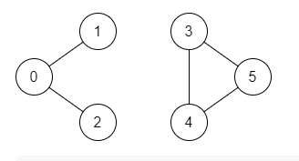

# [1971. Find if Path Exists in Graph](https://leetcode.com/problems/find-if-path-exists-in-graph/)

There is a **bi-directional** graph with <code>n</code> vertices, where each vertex is labeled from <code>0</code> to <code>n - 1</code> (**inclusive**). The edges in the graph are represented as a 2D integer array <code>edges</code>, where each <code>edges[i] = [ui, vi]</code> denotes a bi-directional edge between vertex <code>ui</code> and vertex <code>vi</code>. Every vertex pair is connected by **at most one** edge, and no vertex has an edge to itself.

You want to determine if there is a **valid path** that exists from vertex <code>source</code> to vertex <code>destination</code>.

Given <code>edges</code> and the integers <code>n, source</code>, and <code>destination</code>, return <code>true</code> if there is a **valid path** from <code>source</code> to <code>destination</code>, or <code>false</code> otherwise.

 

## Example 1:


```
Input: n = 3, edges = [[0,1],[1,2],[2,0]], source = 0, destination = 2
Output: true
Explanation: There are two paths from vertex 0 to vertex 2:
- 0 → 1 → 2
- 0 → 2
```
## Example 2:


```
Input: n = 6, edges = [[0,1],[0,2],[3,5],[5,4],[4,3]], source = 0, destination = 5
Output: false
Explanation: There is no path from vertex 0 to vertex 5.
```

## Constraints:

- <code>1 <= n <= 2 * 105</code>
- <code>0 <= edges.length <= 2 * 10<sup>5</sup></code>
- <code>edges[i].length == 2</code>
- <code>0 <= ui, vi <= n - 1</code>
- <code>ui != vi</code>
- <code>0 <= source, destination <= n - 1</code>
- There are no duplicate edges.
- There are no self edges.