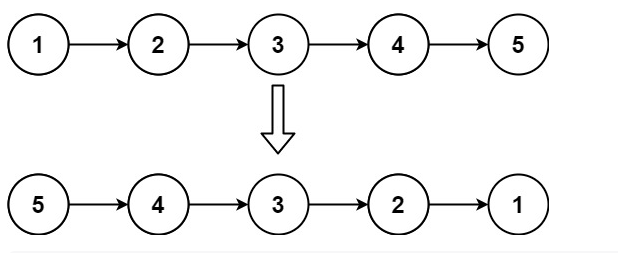
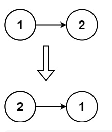

#[206. Reverse Linked List](https://leetcode.com/problems/reverse-linked-list/description/)

Given the head of a singly linked list, reverse the list, and return the reversed list.

## Example 1


```Input: head = [1,2,3,4,5]
Output: [5,4,3,2,1]
```

## Example 2



```
Input: head = [1,2]
Output: [2,1]
```

## Example 3:
```
Input: head = []
Output: []
```
## Constraints:

- The number of nodes in the list is the range <code>[0, 5000].</code>
- <code> -5000 <= Node.val <= 5000</code>
